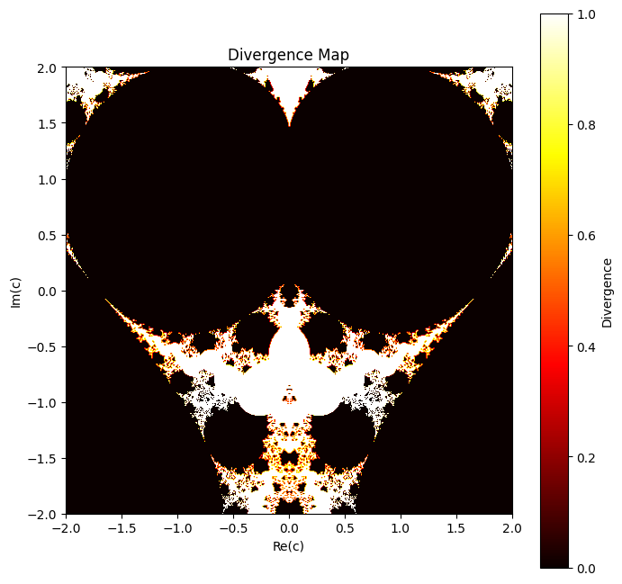

# Tetration-Visualization
복소수를 사용한 테트레이션 연산과 발산 매핑의 시각화 탐색. 테트레이션 성장 및 안정성 영역의 그래픽적 표현 포함.

# 🔢 Visualization of Tetration Operation

## 📌 프로젝트 개요
이 프로젝트는 **테트레이션(Tetration) 연산의 시각화**를 수행하는 시뮬레이션입니다.
테트레이션은 거듭제곱을 여러 번 반복하는 연산으로, 복소수 영역에서의 수렴 및 발산 성질을 시각적으로 분석하는 데 중점을 둡니다.

**시각화 목표:**
- 테트레이션 연산을 복소수 평면에서 수행하여 수렴 및 발산 영역을 분석
- 발산 지도(Divergence Map)를 생성하여 특정 복소수 값이 연산을 반복했을 때 발산하는 정도를 색상으로 표현
- 복소수 테트레이션의 패턴을 직관적으로 이해할 수 있도록 그래프와 색상 매핑 적용

이 프로젝트는 **고급 수학 개념을 시각적으로 탐색**하는 실험적 모델입니다.

---

## 🕒 개발 히스토리
- 📌 **최초 작성:** 2024년 3월 31일  
- 📌 **업데이트:** 2025년 3월 (GitHub 공유 및 문서화 추가)  
- 📌 **Google Colab에서 실행 후 GitHub에 업로드**  
- 📌 **Matplotlib을 활용한 수렴/발산 지도 생성**

---

## 📂 프로젝트 폴더 구조
```
📄 Divergence Map.png                # 테트레이션 발산 지도
📄 Visualization of Tetration Operation.ipynb   # 주요 코드 및 실행 파일 (Google Colab 환경에서 실행 가능)
📄 README.md                         # 프로젝트 설명 파일
```

---

## 🔢 테트레이션 연산 개요
테트레이션은 "a^a^a^..." 형태의 연산을 반복하여 생성되는 거듭제곱 타워입니다.

**기본 개념:**
1. **연산 정의:**
   $$
   \text{tet}(a, n) = a \uparrow\uparrow n = a^{a^{a^{...}}} \quad \text{(n번 반복)}
   $$
2. **복소수 평면에서의 적용:**
   - 특정 복소수 \(c\)에 대해 \( z_0 = c \)를 설정한 후,
   - \( z_{n+1} = c^{z_n} \) 를 반복하여 수렴 여부를 확인

---

## ⚙️ 코드 설명
### 1️⃣ 발산 지도(Divergence Map) 생성
- 복소수 평면에서 특정 영역을 샘플링하여 테트레이션을 반복 수행
- 결과가 일정 기준 이상 커지는 경우 "발산(Divergence)"으로 간주
- 수렴/발산 여부를 컬러 매핑하여 시각적으로 표현

### 2️⃣ 시각화 방법
- **Matplotlib을 사용하여 복소수 영역을 2D 컬러 맵으로 표현**
- 발산 속도를 색상 스케일로 변환하여 시각적 패턴을 생성
- **검정색(Black): 수렴**, **흰색(White): 빠른 발산**, **노랑/빨강: 중간 정도의 발산 속도**

---

## 📊 시뮬레이션 결과
아래 이미지는 특정 복소수 평면에서 테트레이션 연산을 적용한 후 생성된 발산 지도입니다.



- 검은색(Black): 테트레이션이 수렴하는 영역
- 흰색(White): 빠르게 발산하는 영역
- 붉은색/노란색: 발산 속도가 중간 정도인 영역

이를 통해 특정 복소수 \(c\)가 테트레이션 연산에서 안정적인지를 분석할 수 있습니다.

---

## 🏃 실행 방법
### 📌 Google Colab에서 실행
1. `Visualization of Tetration Operation.ipynb` 파일을 Colab에서 열기
2. 셀을 순차적으로 실행하여 발산 지도 생성
3. Matplotlib 그래프를 통해 결과 분석

### 📌 로컬 환경에서 실행 (Jupyter Notebook)
```bash
jupyter notebook "Visualization of Tetration Operation.ipynb"
```

---

## 🚀 마무리
이 프로젝트는 **테트레이션 연산의 특성을 시각적으로 탐구**하는 실험적 모델입니다.

📌 향후 개선 사항:
- 테트레이션 연산의 수렴 속도 분석 및 최적화
- 3D 시각화를 활용한 고차원 패턴 분석
- 다양한 초기값 조건에서의 패턴 비교
